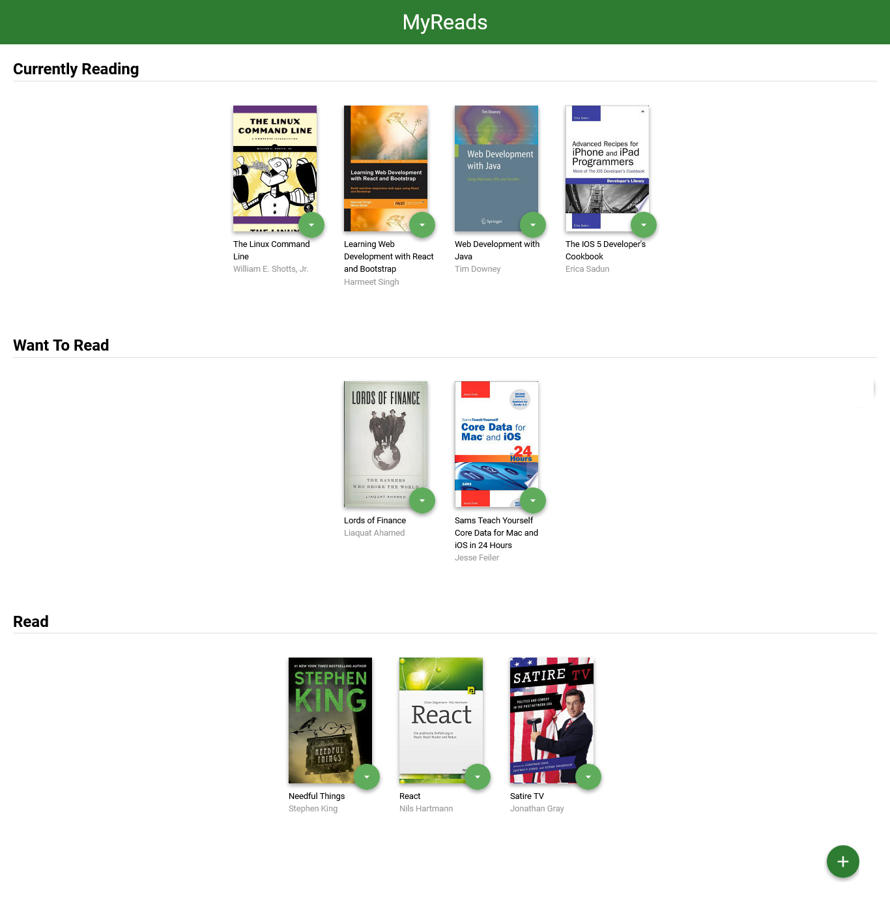
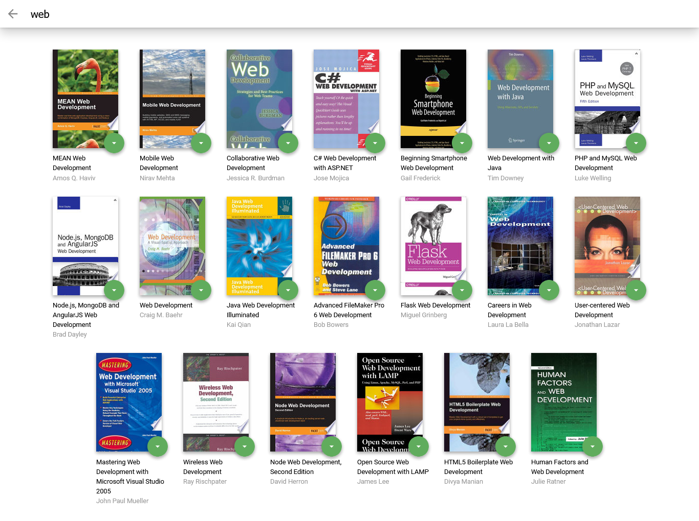

📗 MY READS APP
===
My reads app is the first project of my Udacity React Development Cross-Skilling . Click the link below for more information on the course.

[Udacity React Development Cross-Skilling](https://egfwd.com/specializtion/react-development/)

This course is provided by Scholarship Egypt FWD

## 📝 Papar Information
- Title:  `MY-READS`
- Author:  `Ahmed`,`Mahmoud`,`Abdelfattah`
- demo: [https://arxiv.org/abs/xx]

## 💻 Install
- The first thing  : I did was start with a fresh Create React App instance to use the lasted version of react
- the commends for install react

  ```
  npx create-react-app my-reads

  cd my-reads

  npm start
  ```

- The Second thing &nbsp;: I Delete some file which I don't need them in public and src folder expect:
  ```
  |—— public
    |—— favicon.ico
    |—— index.html
  |—— src
    |—— App.js
    |—— index.js
  ```
  **and you can see all Directory Hierarchy in section of it**
- The third thing &nbsp;&nbsp;&nbsp;&nbsp;&nbsp;&nbsp;: I copied files of styled and API and icon from [start repository](https://github.com/udacity/nd0191-c1-myreads/) from Udacity GitHup and add them to my app folder
- The fourth thing &nbsp;&nbsp;&nbsp;&nbsp;: I init new git repo on my-reads folder
  ```
  git init
  git commit -m "first commit"
  git branch -M main
  ```
- The fifth thing  &nbsp;&nbsp;&nbsp;&nbsp;&nbsp;&nbsp;&nbsp;&nbsp;: I created new repo on my GitHup account and add to my local repo
  ```
  git remote add origin git@github.com:ahmed-ENDless/22.git
  git push -u origin main
  ```
- The sixth thing  &nbsp;&nbsp;&nbsp;&nbsp;&nbsp;&nbsp;&nbsp;&nbsp;: I init react-router-dom package which I used it to route in this app
  ```
  npm install react-router-dom
  ```
- The seventh thing  &nbsp;&nbsp;&nbsp;&nbsp;&nbsp;&nbsp;&nbsp;&nbsp;: After end build the app I use npm package to build it to be ready to client use it
  ```
  npm run build
  ```
## 💽 Dependence

```
 "dependencies": {
    "@testing-library/jest-dom": "^5.16.4",
    "@testing-library/react": "^13.1.1",
    "@testing-library/user-event": "^13.5.0",
    "react": "^18.1.0",
    "react-dom": "^18.1.0",
    "react-router-dom": "^6.3.0",
    "react-scripts": "5.0.1",
    "web-vitals": "^2.1.4"
  }

```
- you can install this dependence my use npm package by command
  ```
    npm install
  ```
## 🕹 Use
**The application consists of two pages:**

### 🏠 main page
- the main page is the first page when open the app
- In this application, the main page displays a list of "shelves" (i.e. categories), each of which contains a number of books. 
- _The three shelves are:_ </br>
  - Currently Reading </br>
  - Want to Read </br>
  - Read
- you can move book from shelf to other by clicked on circle button which above every book and select the shelf option which you want.
- you can remove book from shelf  by clicked on circle button which above every book and select the none option



### 🔍 search page
- you can go to search page by clicked on the circle button on bottom right on home page 

- The search page has a text input on the top that used to find books. As the value of the text input changes, the books that match that query are displayed on the page, along with a control that lets you add the book to your library



## ➡️ Directory Hierarchy
```
|—— .gitignore
|—— node_modules
|—— package-lock.json
|—— package.json
|—— public
|    |—— favicon.ico
|    |—— index.html
|—— src
|    |—— App.css
|    |—— BooksAPI.js
|    |—— component
|        |—— App.js
|        |—— Home.js
|        |—— Nested Home
|            |—— Nested Shelf
|                |—— Book.js
|            |—— Shelf.js
|        |—— Search.js
|    |—— icons
|        |—— add.svg
|        |—— arrow-back.svg
|        |—— arrow-drop-down.svg
|    |—— index.css
|    |—— index.js
|—— structures.txt
```

## 🌲 Components tree 
```
                App
                 |
           Home......Search
           |           |
        Shelf           |
         |               |
       Book             Book
```
## 👨🏻‍💻 Code Details
- I used Function Components - not class Components in react library.
- I used `useState` and `useEffect` hooks.
- I uses JSX syntax.
- I used .js -not .jsx to javascript file.

## ↩️ References

### public Resources:
- [react Documentation](https://reactjs.org/docs/getting-started.html)
- [React Router Documentation](https://reactrouter.com/docs/en/v6)
- [React API](https://reactjs.org/docs/react-api.html)
### Udacity Resources :
- [Project Rubric](https://review.udacity.com/#!/rubrics/3624/view)
- [Udacity HTML Style Guide](http://udacity.github.io/frontend-nanodegree-styleguide/index.html)
- [Udacity CSS Style Guide](http://udacity.github.io/frontend-nanodegree-styleguide/css.html)
- [Udacity JavaScript Style Guide](http://udacity.github.io/frontend-nanodegree-styleguide/javascript.html)
- [Udacity's Git Style Guide](https://udacity.github.io/git-styleguide/)

## 🔑 License
**This project is licensed under the terms of the [MIT](https://choosealicense.com/licenses/mit/) license.**

##
👋 I wish you a happy journey with books on our application

<!-- # **MYREADS APP**
